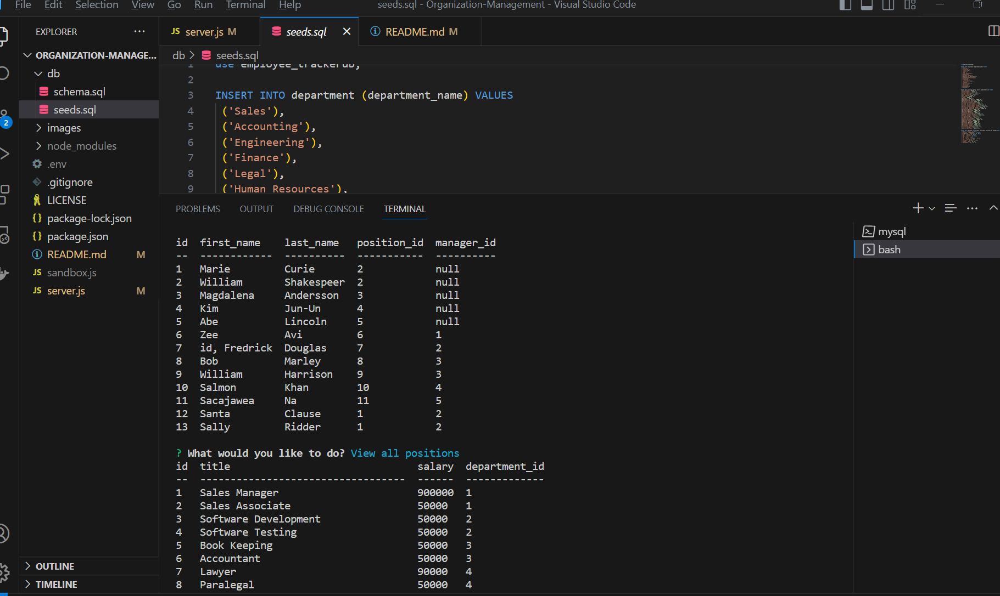

# Organization-Management

 ## Table of Contents
 ---
  - [Description](#Description)
  - [Image](#Image)
  - [Challenges](#Challenges)
  - [Installation](#Installation)
  - [Technologies](#Technologies)
  - [License](#License)
  - [Contributors](#Contributors)
  - [Tests](#Tests)
  - [Contact](#Contact)
  - [Github](#github)
  - [Questions](#questions)
  
  ## Description
  ---
  Keep your business organized with Organization Management. A tool that allows users to collect, track, update, and delete, data from their employees.

  ## ScreenShot
  ---
  

  ## Video of passing tests
  ---
  
  https://app.castify.com/view/30349098-031f-43b3-ad9b-bc1b9453c095

  ## Technologies
  ---
  Node.js, Inquirer, Javascript, Mysql2, tableConsole, dotenv

  ## Contributors
  ---
  Sachi Takaoka

  ## Credit
  ---
  Tutor: Sachin Jhaveri

  ## Contact
  ---
  sasa@gmail.com

  ## Github
  ---
  - [https://kaleikautakaoka.github.io](https://github.com/kaleikautakaoka/)
  - [https://github.com/kaleikautakaoka/MY-SVG](https://github.com/kaleikautakaoka/Organization-Management)

  ## Resources
  ---
[MySql](https://dev.mysql.com/doc/)
[Mysql Server](https://dev.mysql.com/doc/refman/8.0/en/help.html)
[tutorialspot](https://www.tutorialspoint.com/mysql/mysql-select-database.html)
[w3schools](https://www.w3schools.com/mysql/mysql_select.asp)
[stackoverflow](https://stackoverflow.co/teams/?utm_source=adwords&utm_medium=ppc&utm_campaign=kb_teams_search_nb_dsa_targeted_audiences_namer&_bt=658164167919&_bk=&_bm=&_bn=g&gclid=CjwKCAjw-vmkBhBMEiwAlrMeF6t62u2_YPgOhZlqF8IaB6aH_RpLce6VnEaeK-T8AYuyqca1LnhevhoCKTwQAvD_BwE)
[packt](https://subscription.packtpub.com/book/web-development/9781788395540/11/ch11lvl1sec66/organizing-test-with-describe)
[Node.js](https://nodejs.org/en)
[inquirer](https://www.npmjs.com/package/inquirer)
[mozilladeveloper](https://developer.mozilla.org/en-US/docs/Learn)
[Youtube](https://www.youtube.com/)
[stackoverflow](https://stackoverflow.co/teams/?utm_source=adwords&utm_medium=ppc&utm_campaign=kb_teams_search_nb_dsa_targeted_audiences_namer&_bt=658164167919&_bk=&_bm=&_bn=g&gclid=CjwKCAjw-vmkBhBMEiwAlrMeF6t62u2_YPgOhZlqF8IaB6aH_RpLce6VnEaeK-T8AYuyqca1LnhevhoCKTwQAvD_BwE)
[packt](https://subscription.packtpub.com/book/web-development/9781788395540/11/ch11lvl1sec66/organizing-test-with-describe)